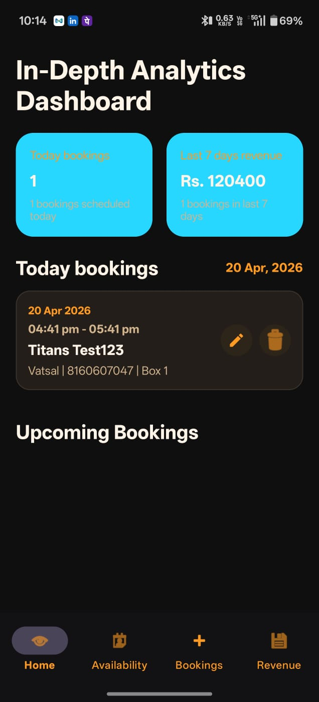

# 📱 Cricket Booking App

## 📌 Description
This is an Android application that allows users to book cricket ground slots, view schedules, and manage bookings.

## 🚀 Features
- User login with mobile number
- View available cricket schedules
- Book slots easily
- View booking history
- Shared booking visibility across users

## 🛠️ Tech Stack
- Java
- Android Studio
- SQLite Database
- RecyclerView

## 📱 Screenshots

### Home Screen

  

## ⚙️ Installation
1. Clone the repo
2. Open in Android Studio
3. Run the project

## 📧 Contact
Ritesh Katre  
LinkedIn: https://www.linkedin.com/in/ritesh-katre-232777202/
