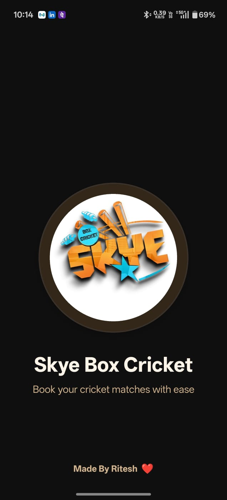
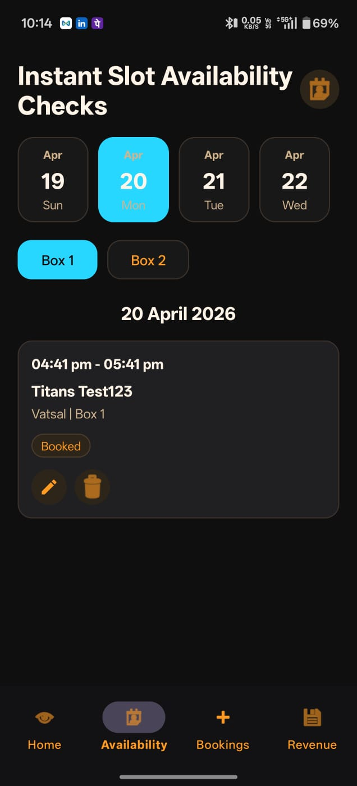
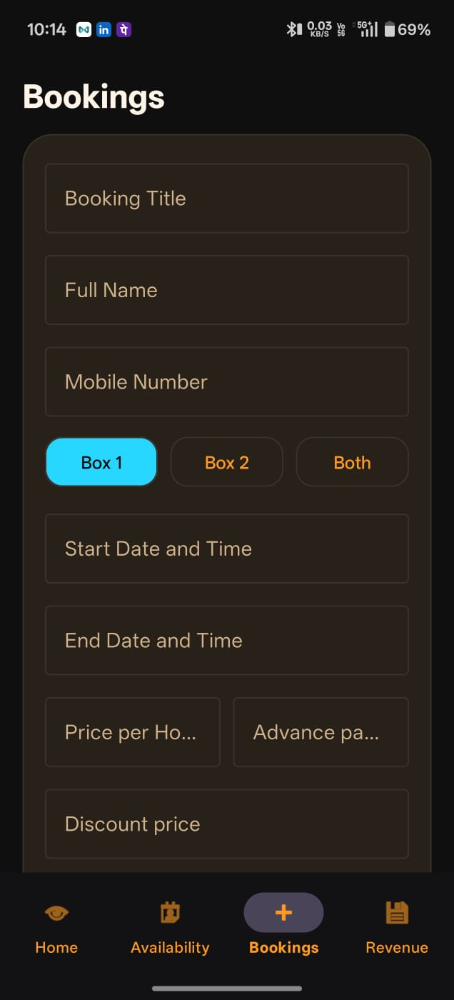
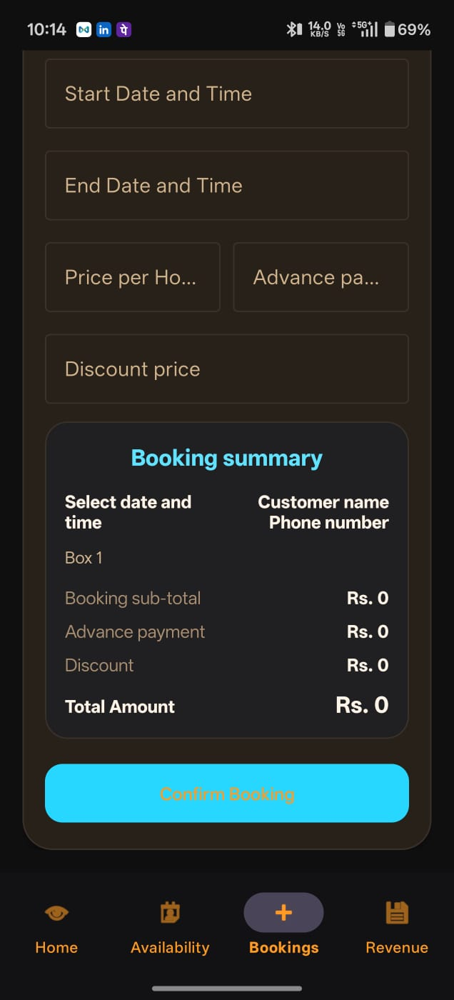
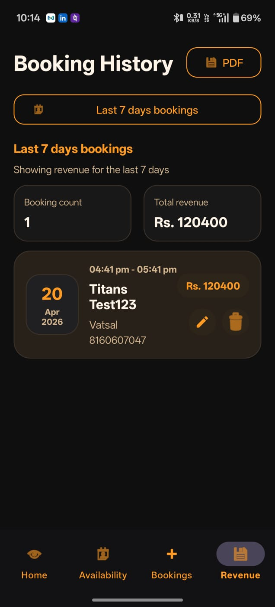

# 📱 Cricket Booking App

## 📌 Description
Cricket Booking App is an Android application that allows users to view available ground schedules and book cricket slots. It provides a simple interface for managing bookings and tracking history. The app ensures seamless booking visibility across multiple users using local database management.

## 🚀 Features
- User login with mobile number
- View available cricket schedules
- Book slots easily
- View booking history
- Shared booking visibility across users

## 🛠️ Tech Stack
- Java
- Android Studio
- SQLite Database & Firebase 
- RecyclerView

## 📱 Screenshots

### Splash Screen

Displays the app logo and initializes resources before navigating to the main screen.

### Home Screen

Shows available cricket schedules and allows users to explore and select booking slots.

### Availability Screen

Displays detailed time slot availability for selected grounds and dates.

### Add Booking Form Screen

Allows users to enter booking details such as name, mobile number, and selected time slot.

### Booking Summary

Provides a summary of all bookings with relevant details for quick review.

### Revenue Screen

Displays total earnings and booking statistics for better tracking and analysis.

## ⚙️ Installation
1. Clone the repo
2. Open in Android Studio
3. Run the project

## 📧 Contact
Ritesh Katre  
LinkedIn: https://www.linkedin.com/in/ritesh-katre-232777202/
